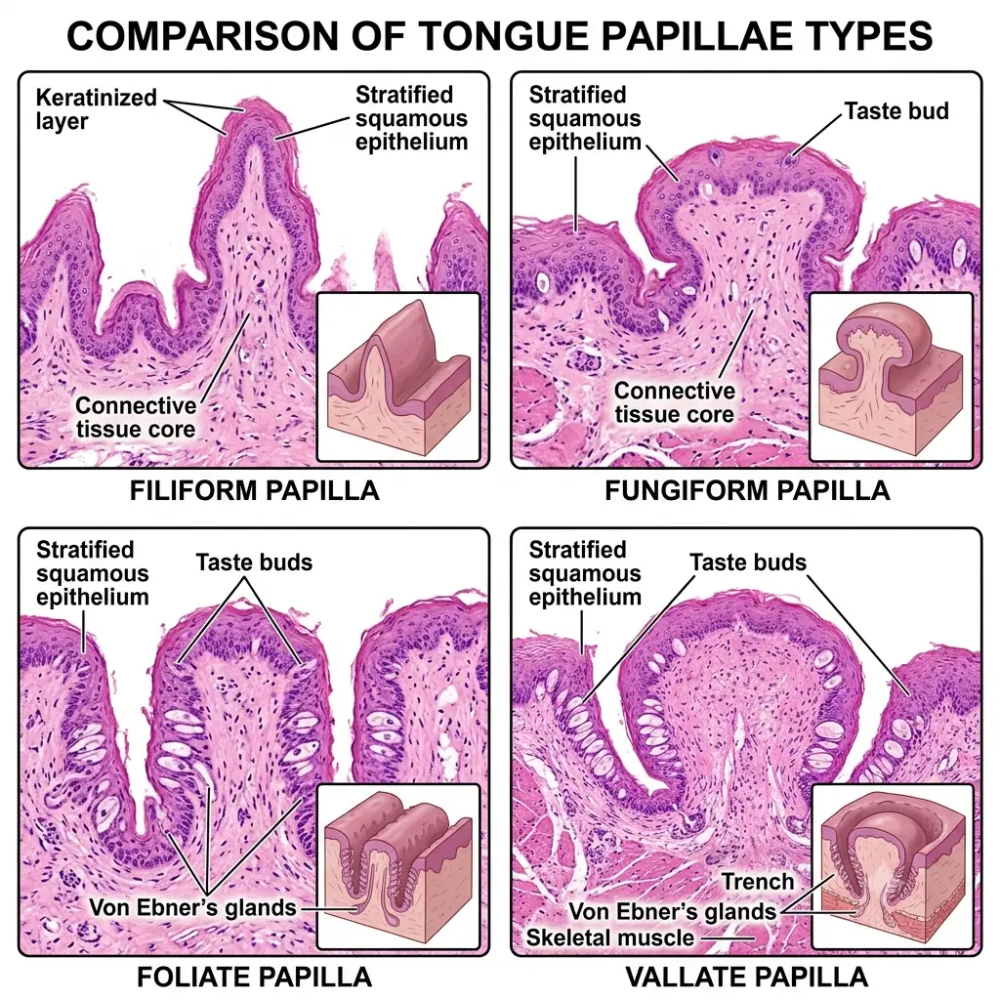

# Circumvallate Papilla

**Circumvallate papillae** are **large, dome-shaped** papillae (8-12) at the **V-shaped sulcus terminalis**, each **surrounded by a trench**. **Taste buds** lie on the **lateral walls**, and **von Ebner's serous glands** open into the trench.

## Trigger Point

> **Large rounded papilla with surrounding epithelial folds** (trench).

## Lingual Papillae

| Papilla | Features |
|---|---|
| Filiform | Numerous, keratinised, no taste buds |
| Fungiform | Mushroom-shaped, taste buds on top |
| Foliate | Leaf-like folds at the sides, taste buds on walls |
| Circumvallate | Large, surrounded by a trench, von Ebner's glands |

## Why Not the Other Options?

**B. Fungiform**
Mushroom-shaped, with taste buds on the top surface, and no trench.

**C. Filiform**
Pointed and keratinised with no taste buds.

**D. Foliate**
Parallel folds on the lateral tongue, without a surrounding trench.

## Mind Capsule

> **Trench + von Ebner's glands = circumvallate**.
