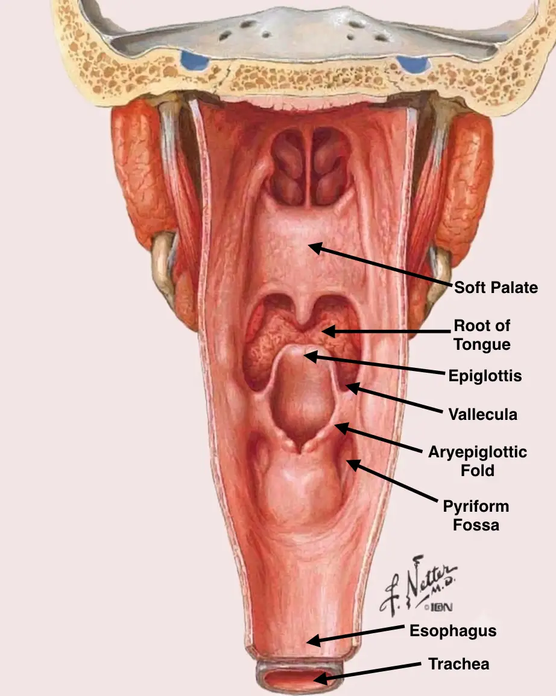

# Pyriform Sinus

The **pyriform sinus (fossa)** is a mucosal recess of the **hypopharynx**, **lateral to the aryepiglottic fold**. It is the **commonest site of hypopharyngeal carcinoma**.

## Key Finding

> Arrow A points to the recess lateral to the aryepiglottic fold.

## Trigger Point

> **Marked recess lateral to the aryepiglottic fold**.

## Subsites of the Hypopharynx

| Subsite | Note |
|---|---|
| Pyriform sinus | Commonest site of cancer |
| Postcricoid region | Plummer-Vinson association |
| Posterior pharyngeal wall | Less common |

## Why Not the Other Options?

**A. Thyroid cartilage**
Part of the laryngeal framework, not a mucosal recess.

**C. Epiglottis**
The leaf-shaped cartilage at the laryngeal inlet.

**D. Vallecula**
A depression between the tongue base and epiglottis, higher up.

## Mind Capsule

> Recess lateral to the aryepiglottic fold = **pyriform sinus**.
